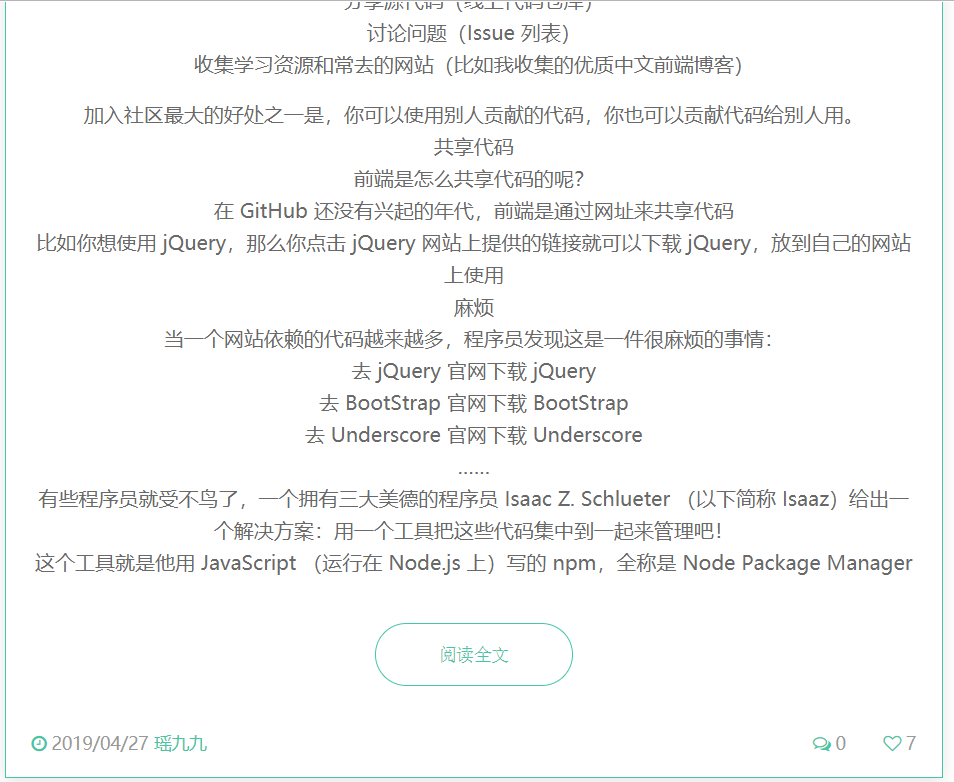

# 博客介绍

这个博客是一个自我学习的实践和检验，将一级项目中按照计划学的HTML、CSS、JavaScript、PHP以及课外日常学习到的node.js、Vuepress等语言技术结合在一起，实操检验自我能力并实现想要的个人Blog。

## 开发人员

- Ybalabala

## 开发初衷

个人网页作为个人学习的成果展示和日常学习的经验总结集合，在程序员社区中日渐流行，更多的人主动去学习并搭建个人网页，将自己的学习经验放在个人网页上。为了进一步更好地学习Web知识并记录学习经验，主动实操实现了自己的个人网页。

## 博客内容说明

### 登录

结合数据库进行登录操作，用户输入学号密码，前端获取用户输入的学号密码，如果数据库内有匹配的数据则登录成功，跳转到文章页面；如果没有匹配的数据则登录失败，会有登录失败的弹窗信息。

### 注册

点击注册按钮，会有注册的弹框出现，输入相应内容点击注册即可注册成功，注册成功后会有弹框提醒；

如果用户注册信息没有填写完全，会有弹框信息提醒用户信息需要填写完全；

如果用户注册的学号已经被注册过了，则会有弹框信息出现提醒用户学号已被注册。

### 个人页面

#### 主页面

登录后页面就会跳转到个人页面，在这个页面，用户不仅可以看到自己的基础个人信息，还可以看到文章列表，看到之前发过的全部文章。

#### 查看文章

文章是经过压缩的，只会显示一部分内容，另一部分内容需要通过点击“显示全文“按钮进行展开。

#### 点赞

可以对任意一篇文章进行点赞，点赞后除了点赞数会进行累加之外，点赞的心图标也会跟着变化。

#### 评论

用户可以在指定文章下进行评论，评论成功后，评论内容会插入到数据库指定的表中，也会有弹框信息出现说明评论成功。

### 发表文章

点击第二个按钮就可以进行发表文章的一系列操作了，发表文章之前需要填写关于文章的内容，比如文章标题、标签、第一部分的内容（就是压缩文章后依旧会显示的这部分内容）以及第二部分的内容。

发帖成功后就可以在文章列表看到刚刚确认发布的文章了。

### 旅游页面

#### 主页面

旅游页面罗列显示旅游景点的图片及其对应的简略描述，可以通过点击“更多”按钮来获取更多的关于这个旅游景点的信息。

#### 查询天气

旅游页面上还可以进行查询天气操作，只需要点击主页面上的云朵图标，就会出现查询天气的弹框，填写完相应信息后即可获得当天那个地点的天气预报。

#### 旅游详情页面

介绍了茶卡盐湖的旅游攻略，以一种比较美观的方式呈现，给用户良好的视觉体验。

采用了轮播图的方式播放茶卡盐湖的照片，并用了引言的格式说明这是一篇旅游攻略，在文章内容部分也插入了一些美景图片。

### 明星页面

可以在这个页面看到BlackPink团体的一些基本信息以及照片、MV等内容。这个页面比较突出的点是它的选择栏是自动旋转的。

## 开发阶段总结

从一开始的迫于一级项目的压力开始个人网站的制作，到现在可以主动学习实现网页新样式，我觉得不仅仅是自己在技术方面视野变得开阔了，能力经过了近两年也成长了一些，更多的是心态的变化——被动式学习转变为主动式学习。规划是处理时间最好的办法，也是让时间拉长的一种方式，只有规划好自己的时间安排，在任务截止日期来临时，才不会慌张和感到时光匆匆。

